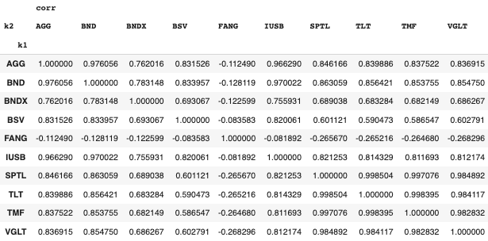
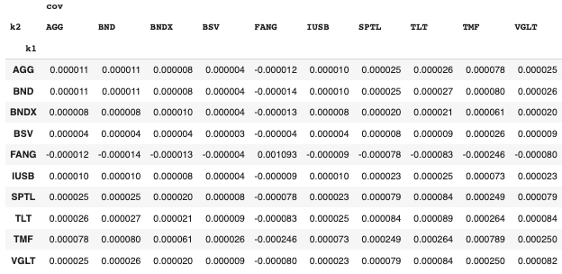

# Financial-Market-GWP_1
**Note:**
- **Portfolio A** is done using MS Excel
- **Portfolio B** is done using MS Excel
- **Portolio C** is done using Python

All the relevant files can be found in this repository.

**Rahul Garg**

**MscFE 560**

**April 27, 2023**

## Portfolio A: Buy one asset and short one asset

In order to select the required assets, I have taken a two income stocks
one from Pfizer Inc. (PFE) and one from Jones Lang LaSalle Incorporated
(JLL) for shorting and to buy one asset from, I have chosen 3 Equity
ETFs namely Technology Select Sector SPDR Fund (XLK), Energy Select
Sector SPDR Fund (XLE) and Vanguard Emerging Markets Stock Index Fund
(VWO). The daily price data for these securities is of three years from
24th April, 2020 to 24th April, 2023. Taking risk free rate to be 5.04%.
After performing all the statistical analysis, which is explained in
below sections, we selected JLL stock to short and XLE equity ETF to buy
as these are giving us the best Sharpe ratio out of all the six
buy-short combinations. I have started with the dummy weights and then
used Excel solver to find the appropriate weights to maximize Sharpe
ratio. All this can be seen in the provided Excel workbook (See sheet
titled portfolio analysis and optimization).

As can be seen from the chart 1 the capital allocation line intersect
the efficient market curve at the volatility level of 39.43% with annual
return of 40.08%. Hence, giving the maximum Sharpe ratio at these
weights for this combo of assets.

**ANALYZING PORTFOLIO ON DIFFERENT PARAMETERS**

**1. For each investment, the statistics are:**

                                                           

From the table 3, it is evident that XLE is giving the highest return
with second highest volatility yet giving the highest Sharpe ratio
among the assets. Similarly, JLL has the most volatility. So, the
first hint for shorting JLL and buying XLE comes from this. Now to
check about the correlation among them, from the table 4b, XLK and VWO
are most correlated as they both track the market though of different
niche. Given our needs, JLL and XLE are most correlated and 2nd most
overall.

**2. Answering the following questions about the portfolio:**

**2.1 Shorting: Can this portfolio be sold short?**

Yes, this portfolio can be sold short. Essentially, one is betting
against the return of the portfolio believing price of the shorted
security will go up and price of XLE will go down
or price of XLE will go down significantly, offsetting the gain of JLL
security.
Let say, return of JLL remains same and return of XLE now fallen down
to 30%.
So, portfolio returns become

$$P_{r} = 1.18 \times 30 + ( - 0.18) \times 17.11$$

$$P_{r} = 32.32$$

So, one is gaining 40.08 - 32.32 = 7.76% return by shorting the
portfolio.

**2.2 Credit Risk: Does this portfolio have credit risk?**

Since, we are investing in equity ETF by leveraging a stock, the
portfolio have no credit risk as such. Though it has market and other
idiosyncratic risks.

**2.3 Portfolio Statistics: weighted return and variance of the
portfolio.**

$$P_{ret} = \ W_{A} \times A_{ret} + \ W_{B} \times B_{ret}$$

$$W_{A} = 1.18$ $W_{B} = - 0.18$$
>
$$A_{ret} = 36.55$ $B_{ret} = 17.11$$

**Weighted Portfolio Return =** $\mathbf{P}_{\mathbf{ret}}$ **= 40.08%**

$$\sigma_{AB}^{2} = (W_{A}^{2} \times \sigma_{A}^{2} + \ W_{B}^{2} \times \sigma_{B}^{2} + 2\rho_{AB} \times W_{A} \times W_{B} \times \sigma_{A} \times \sigma_{B}) \times T_{D}$$

$$\sigma_{A} = 2.26$ $\sigma_{B} = 2.56$$

$$\rho_{AB} = 0.484\ (Correlation)$$

$$T_{D} = 252\ (No.\ of\ Trading\ Days\ in\ a\ year)$$

**Variance of Portfolio =**
$$\mathbf{\sigma}_{\mathbf{AB}}^{\mathbf{2}}\mathbf{= 1554.72}$$

**Volatility of Portfolio =**
$$\mathbf{\sigma}_{\mathbf{AB}}\mathbf{= 39.43}$$

**2.4 Diversification: diversification between the two assets**

According to the table 1 and table 3, if we bought on XLE stock and
shorted nothing, we would get average annual return of 36.55% with
volatility 35.94% and Sharpe ratio of 0.877. But with shorting 18% of
JLL stock we increased our return to 40.08% with volatility of 39.43%
giving us Sharpe ratio of 0.889 (see table 2). So, by combining two
assets we increased return per unit of risk. Hence, leveraging is
beneficial for us.
Since we are only buying one asset and shorting other, there is not
much diversification here. Risk is not being reduced by shorting JLL,
but increase in volatility is compensated by increase in return.
Though, we can diversify this portfolio by buying more stocks or
bonds.

**2.5 Comparing Portfolios:**

This portfolio is giving more returns than portfolio B and is more
volatile. But portfolio B is giving the best return per unit of risk
among the three portfolios. Portfolio C is giving us the most return
and is most volatile with best Sharpe ratio. Despite best Sharpe
ratio, this large volatility make it the most risky proposition.
Portfolio B is best among the three in terms of diversification

.

**2.6 Assessing Risk and Performance: economic scenarios that would
affect your security**

We have bought the XLE equity, which tracks the oil sector and oil
sector is greatly affected by the supply and demand of oil. For
instance, at the peak of COVID, the demand of oil became so low that
the price of XLE fell down drastically. Hence, similar event would
negatively affect the portfolio's return. Now, a few months back
because of Ukraine war, Russia, a major oil producing country, was hit
by the sanctions. Hence, the supply of oil in the international market
was short resulting in high demand and high portfolio returns due
price rise of XLE stock.

JLL belongs to real estate sector, above mentioned things doesn't
affect it much. Rise in inflation, rise in interest rates, slow
economic growth negatively affect its price which in turn positively
affect the portfolio's return as we are shorting it. Currently, US is
facing high inflation along with slow GDP growth which is one of the
reason JLL is trading now at its lowest price range in a year.

**2.7 Disrupters:**

a. Potential influence of the central bank on the portfolio.

Central Bank is responsible for maintaining inflation rate as well as
interest in a country. So, if they decide to bring down the interest
rate or cost of borrowing and it will help in rallying the JLL's price
which brings down the portfolio's return. Also, liquidity in the
market is controlled by the central bank. Low liquidity, low JLL's
return and high portfolio's return.

b\. Potential influence of the investment banks on the portfolio.

Investment banks can both positively and negatively impact the
portfolio. For example, through their analysis they can rate this
portfolio good or bad on different metrics. They can short the
portfolio, which affects the portfolio. Also, they can rate the
portfolio's underlying securities which affect the sentiments of
potential investors which in turn affect the portfolio.

**2.8 Re-assessing Risk:**

a\. Do the two investments in the portfolio have the same skew?

According to the table 3, JLL has skew of 0.504 and XLE has skew of
0.223. The normal distribution curve of these two (See the chart
titled excel sheet in the Portfolio A workbook in zipped folder)
clearly depicts this difference in skewness as JLL is more volatile
and has more outliers.

b\. Is there a difference between the types of correlation?

Since there is only two securities in this portfolio, there is only
one correlation coefficient which is 0.484 which suggest, they move in
the same direction. Their correlation is on the stronger side.

**CONCLUSION**

In the end, it would be interesting it to analyze this portfolio by
adding more securities by buying some long and some short positons.
Also, it will be of further interest to investigate the long short
pairs trading strategy by having two strongly correlated assets. What
happens if the securities in this portfolio is to be negatively
correlated or has strong positive correlation, does this increase
volatility. This is the subject of further research.

---------------------------------------------------------------------------------------------------------------------------------------

**Deepak Aggarwal**

**MScFE 560**

**3 June 2025**

## Portfolio B : Buy any number of Assets (No Shorting)

The group work project portfolio selected is option B, which requires
the purchase of any number of assets without shorting. The portfolio was
constructed by selecting three different assets to achieve the maximum
Sharpe Ratio. The Sharpe Ratio is a measure of the risk-adjusted return
of the portfolio and is used to evaluate the portfolio\'s performance
relative to its risk.

To achieve the maximum Sharpe Ratio, the portfolio\'s asset allocation
was determined based on each asset\'s expected return and risk. By
diversifying the portfolio across different asset classes, the
portfolio\'s risk was minimized while maintaining the potential for
returns.

The stocks in the portfolio were carefully selected to ensure that they
have a low correlation with each other. This is done to hedge the
portfolio against any potential market risks that may arise. The
portfolio consists of three different assets, including two equity ETFs
(MON100 and Niftybees), three stocks/securities (Tata Motors, Voltas,
and Indian Hotel), and one cryptocurrency (Bitcoin). By diversifying the
portfolio with different asset classes and low correlation among the
assets, the risk can be reduced while maintaining the potential for
returns.

The above-selected assets data was collected from Google Finance and
then cleaned to remove any inconsistencies or errors. The econometric
measures for daily returns, including the average, standard deviation,
skew, and kurtosis, were then calculated for each asset. These measures
provide valuable insights into the characteristics of the assets returns
and can be used to analyze their performance and risk. Table 1 displays
the results of these calculations for each asset.

Table 1

The expected return is found using the Sum product of the weight of the
asset and avg. return of the asset which comes out to be 0.1020 which
further multiplied by the number of trading days i.e. 252 in a year to
get the expected return of the portfolio which comes out as 25.70
percent. Next, the portfolio volatility have been calculated using the
covariance and weights of the assets. The portfolio volatility comes out
as 22.72 percent. Sharpe ratio which is found as given below:-

$$Sharpe-Ratio = \frac{expected\, return - risk\, free\, return}{portfolio\, volatility}$$

The Risk-free return in the calculation is taken as 5.04 % which is the
current U.S Treasury bond rate. The Sharpe Ratio for the Portfolio comes
out as 0.91. High Sharpe Ratio suggests that the portfolio has performed
well relative to its risk and that it may be a suitable investment
option for risk-averse investors.

**1\. Shorting**

a\. Can this portfolio be sold short? (Hint: Yes, but be sure to explain
part b)

Yes this portfolio can be sold short.

b\. If it can be sold short, walk through the mechanics.

Short selling is called as "Sell now Buy later". Short selling
involves borrowing shares of an asset, selling them on the market, and
then buying them back at a later time to return to the lender. The
difference between the sale price and the purchase price is the profit
or loss from the short sale. As this portfolio contains stocks which
are moderately co related such as Indhotel, Tatamotors, Niftybees and
Voltas with each other. So, when one security falls it is possible
that the other security will fall in relation to other. So, we can
short sell the portfolio.

**2\. Credit Risk**

a\. Does this portfolio have credit risk?

Credit risk arises in case of bonds when the issuer of the bond fails
to pay the interest or fails to re-pay the principal amount. This
Portfolio consists of assets such as ETF, Stocks and Cryptocurrency
which do not holds credit risk. However other risk such as market
risk, liquidity risk still persist with portfolio.

**3\. Portfolio Statistics**

a\. Compute the weighted return of the portfolio.

Weighted return of portfolio is calculated as per formula given below:

$$Weighted\, Return\, of\, portfolio = \sum_{i = 1}^{n}(Weight\, of\, Asset\, i \times Return\, of\, Asset\, i)$$

b\. Compute the Variance of the portfolio.

Variance of Portfolio comes out as 516.17

**4\. Diversification**

a\. Describe the diversification in words between the two assets.

Correlation matrix given in table 3 measures the strength of
relationship between assets and from the correlation matrix it can be
seen that the correlation coefficient between BTCINR and the
equity-based assets in the portfolio is relatively low, with
coefficients ranging from 0.01 to 0.07. This suggests that Bitcoin
provides diversification benefits to the portfolio by having low or
negative correlations with the equity-based assets.

b\. Do you think this portfolio is well diversified or not

Yes, I think this portfolio is well diversified as by investing in
both the MON100 ETF (which tracks the NASDAQ 100 Index) and the
NIFTYBEES ETF (which tracks the Nifty 50 Index), an investor can gain
exposure to a diverse set of companies across two different countries
(the United States and India). This can provide geographical
diversification benefits, as well as potential opportunities for
growth and risk reduction by investing in different markets with
different economic and political conditions.

As, this portfolio contains Bitcoin which can further diversifies the
risk of the portfolio as Bitcoin have different risk profile and low
correlation to other equity assets in the portfolio.

**5\. Comparing Portfolios**

a\. How does your portfolio compare to the others in terms of risk?

Portfolio B has a lower return and volatility compared to Portfolios A
and C, but a higher Sharpe ratio compared to Portfolio A. This
indicates that it has a better risk-adjusted performance compared to
Portfolio A.

b\. How does your portfolio compare to the others in terms of return?

Portfolio B consists of three different types of assets and have long
all portfolio assets. Portfolio B has higher Sharpe Ratio as compared
to Portfolio A and lower volatility with respect to other portfolios A
and C. With a better risk-adjusted return, this portfolio can offer
investors the opportunity to earn higher returns per unit of risk
taken, potentially leading to more stable, long-term wealth
generation.

**6\. Assessing Risk**

a\. Describe economic conditions or scenarios that would affect your
security.

The performance of the MON100 and NIFTYBEES ETFs, as well as the Tata
Motors, Voltas, and Indian Hotel stocks, can be impacted by the
overall conditions of the stock markets in the United States and
India. Economy Factors such as interest rates, inflation, GDP growth,
geopolitical events, and company earnings reports can all influence
stock prices.

When interest rates rise, it can cause a decrease in investment in
stocks as investors may shift their investments to risk-free assets
like government bonds or other fixed-income securities that offer a
guaranteed return. This is because higher interest rates increase the
yield on these fixed-income securities, making them more attractive to
investors who are seeking a guaranteed return on their investment. In
contrast, stocks are typically viewed as riskier investments that may
not offer a guaranteed return, and as interest rates rise, the cost of
borrowing also increases, which can negatively impact corporate
profits and the overall stock market. However, it\'s important to note
that the relationship between interest rates and stock prices is
complex and can be influenced by a variety of other factors, such as
economic growth, inflation, and investor sentiment.

b\. Determine if similar events would hurt one or both members of a
portfolio.

Events such as interest rates rise, causes a decrease in investment in
stocks as investors may shift their investments to risk-free assets
like government bonds or other fixed-income securities that offer a
guaranteed return. This is because higher interest rates increase the
yield on these fixed-income securities, making them more attractive to
investors who are seeking a guaranteed return on their investment. In
contrast, stocks are typically viewed as riskier investments that may
not offer a guaranteed return, and as interest rates rise, the cost of
borrowing also increases, which can negatively impact corporate
profits and the overall stock market. However, it\'s important to note
that the relationship between interest rates and stock prices is
complex and can be influenced by a variety of other factors, such as
economic growth, inflation, and investor sentiment.

Performance of Bitcoin can be impacted by events such as regulatory
changes, theft and fraud, regulatory uncertainty or crackdowns can
also cause a decline in the price of Bitcoin

**7\. Performance**

a\. Now describe economic conditions or scenarios that would greatly
improve each security. For example, increased business and vacation
travel could increase the demand for airline parts (Note: this
particular example CANNOT be used!).

Economic condition of the country such as stable Interest Rates,
stable geopolitical environment which boosts the confidence of the
investor could lead to increase in prices of the security.

b\. Determine if similar events would help one or both members of a
portfolio.

Event such as increase in the adoption of the crypto currency by the
govt., regulation in favor of the crypto assets will increase the
demand of the bitcoin which causes the increase in the price of the
bitcoin.

**8\. Disrupters**

a\. List the potential influence the central bank may have on the
portfolio.

Monetary policy decisions taken by central banks affects the assets of
the portfolio such as stocks and the equity etf. Rise in Interest
rates and Inflation negatively affect the portfolio and the factors
such Quantitative easing (infusion of liquidity by the central banks)
positively affect the portfolio.

b\. List the potential influence that investment banks may have on the
portfolio.

Investment banks activity such as research report and recommendation
can have effect positively or negatively on the portfolio stocks. they
are also some times market maker which can increase or decrease the
demand of the stock.

**9\. Re-assessing Risk**

a\. Do the two investments in the portfolio have the same skew?

No two investments have same skew.

b\. Is there a difference between the types of correlation?

Co-relation measures the strength of the relationship between the
variables. There are two ways to measure correlation Pearson Co
relation coefficient and Spearman Co relation. Both these correlation
ranges from -1 to 1. -1 indicates negative/inverse correlation. 1
indicates the Positive/direct relation between the assets. The value 0
represents the no relation between the assets.

------------------------------------------------------------------------------------------------------

**Arman Anwar**

**MScFE 560**

**April 27, 2023**

## Portfolio Option-c: The larger context of the Portfolio Option-C

The Option-C portfolio addresses the quick recovery hypothesis espoused
by the Congressional Budget Office (The Economic Outlook for 2023 to
2033 in 16 Charts).

> The growth of real GDP is expected to be restrained in 2023 ... Real
> GDP growth is projected to rebound after 2023 as the growth of
> investment and exports increases as a result of lower interest rates,
> faster economic growth abroad, and a weaker dollar.

A longitudinal graph from the same report, Fig. 1. illustrates this
below -- the Gross Domestic Product (GDP) of the United States is
represented by the y-axis, while the x-axis represents time. As can be
seen, there is a sharp slowdown forecast in 2023, followed by a sharp
recovery in late 2023 to early 2024

Fig. 1. Historical and Forecast US Gross Domestic Product (The Economic
Outlook for 2023 to 2033 in 16 Charts).

The primary causal force for this fall in the US GDP is the US Federal
Reserve's hike in base lending rate to counter persistent inflation
(Consumer Prices for Shelter up 7.9 Percent from January 2022 to January
2023; Federal Funds Rate - 62 Year Historical Chart; "Inflation Peaking
amid Low Growth"; "Sizing up Inflation -- Institutional.") The chart
below, Fig. 2. from Black Rock, shows the steep climb in inflation
depicted by the yellow line as we approach 2022 "Sizing up Inflation --
Institutional.")

Fig. 2. Euro and U.S. inflation ("Sizing up Inflation --
Institutional.")

Figure 3 below shows the corresponding hikes in the US Federal Reserve
-- the interest rate hikes in 2022 closely tracks, albeit with a slight
lag, the inflation rises shown in Figure 2 (Effective Federal Funds
Rate - FEDERAL RESERVE BANK of NEW YORK.)

Fig. 3. Target Base Lending Rate set by the US Federal Reserve Bank
(Effective Federal Funds Rate - FEDERAL RESERVE BANK of NEW YORK.)

We are looking to design a portfolio that will take advantage of this
coming rise in GDP which, according to Black Rock Capital, will fare
better in high-inflation economic situations and will further benefit
from the windfall as rates are lowered and the GDP rebounds ("Sizing up
Inflation -- Institutional.")

**Meta Design Principles of the Option-c Portfolio**

The meta-design principle adopted for the Option-c portfolio in the
economic context we defined in the previous section involves the
selection of an already vetted technology stock with a low
price-to-earnings (PE) ratio, which has exhibited low volatility and has
demonstrated returns over a period of three calendar years. We would
then look at similarly "vetted" bonds and ETFs negatively correlated
with such stock.

What do we mean by a vetted technology stock? By, vetted, we mean that:
would like to find a stock that has been, somehow, "vetted" by various
parties such as investors, researchers and similarly qualified entities.
The way we went about realizing vetted is that we restrict our choice of
stocks to the members of a respected and reasonably performing
technology Index Fund. Index Funds are securities whose portfolio
closely matches a particular index ("What Are Index Funds, and How Do
They Work?"). The QQQ Index fund closely mimics the NASDAQ-100 index,
which we would think meets our "vetted" criteria -- thus, our goal was
to select a stock from QQQ that meets our stated criteria of a low PE,
high returns, and low volatility -- later in this document we will talk
about how we balance these three criteria. For vetted bonds and ETFs, we
look at listings of performing securities in respected trade
publications("Nasdaq 100 Index"; Invesco QQQ ETF \| Invesco US.) For
bonds, we settled on: IEF, SHY, TLT, SHV, IEI, TLH, BIL, SPTL, TMF, TBF,
VGSH, VGIT, VGLT, SCHO, SCHR, SPTS, GOVT, TBT, TMV (How Far Can Treasury
Yields Climb before Spoiling the Stock Party?) For ETFs, we settled on:
AMJ, IVV, VOO, VTI, QQQ, VEA, VTV, SPY, IEFA, BND, AGG, VUG, VWO, IEMG,
IJR, IJH, VIG, IWF, GLD, VXUS, IWM, VO, IWD, BNDX, WTID, EFA, VYM, VGT,
SCHD, XLK, VCIT, VCSH, VB, ITOT, XLV, BSV, XLE, LQD, VEU, RSP, MUB, VNQ,
SCHX, IXUS, SCHF, XLF, IVW, IAU, USMV, DIA, IWB, IWR, MBB, VTEB, VT,
QUAL, VV, JPST, IGSB, EEM, IVE, VBR, TIP, DGRO, IUSB, SDY, DVY, SCHB,
ACWI, MDY, XLP, VGK, VHT, SCHG, VTIP, SPYG, VMBS, USFR, SPLG, EFV, VOE,
SPDW, EMB, XLU, SPYV, SCHP ("100 Highest 5 Year ETF Returns".)

There were two additional, stylistic principles we wanted to adopt:

1.  Parsimony: A shorter and humanly understandable list of securities.

2.  Empirical curation: the portfolio\'s membership should be determined
    by algorithmizing our design criteria and limiting subjective
    judgment.

**Algorithmizing the Option-c portfolio design**

To algorithm-ize the Option-c portfolio design, we must codify a scoring
criterion that transforms inputs such as stock fundamentals and returns
into a score. A higher score indicates a better candidate for our
portfolio compared to a stock with a relatively lower score.

We choose a simple linear model combining the algebraic sum of three
quantities to score a particular stock. The three quantities are:

1.  Inverse L1 Normalized volatility -- to prioritize the most stable
    stocks. Volatility, as represented by the standard deviation of the
    stock's historical returns, is a measure of its volatility. Higher
    the standard deviation, the higher the volatility. Hence we chose
    the inverse of the L1 Normalized volatility, resulting in larger
    values for less volatile stocks.

2.  Inverse L1 Normalized price-to-earnings ratio -- to prioritize the
    most undervalued stocks. The Price to Earnings ratio represents who
    overvalued the stock compared to its values -- a low Price to
    Earnings ratio means that the stock is good for the market price.
    Thus, taking the inverse L1 norm of the PE values, we get a quantity
    that increases the more valuable the stock is for the asking price.

3.  L1 Normalized returns -- to prioritize the most highly performing
    stocks, we chose the L1 Normalized returns of a stock.

We Normalize all three quantities so that
when we add them to a weighted sum. Such a generalized sum can be
represented as a beta-weighted sum of the three quantities, which can be
mathematically written as:

In our current algorithm implementation, we set the beta weights to one
resulting in all three criteria being equally weighted. When then, score
the QQQ constituent stocks, and select the top scorer.

Table 1 Scoring results of the QQQ constituent stocks.

As shown in Table 1, the highest scoring stock is FANG, and the next,
MRNA, is behind quite a bit with a score difference of over 0.2 points.
According to Barons:

> > Diamondback Energy, Inc. is an independent oil and natural gas
> > company that engages in the acquisition, development, exploration,
> > and exploitation of unconventional, onshore oil and natural gas
> > reserves. It operates through the Upstream and Midstream Services
> > segments ("FANG \| Diamondback Energy Inc. Stock Overview (U.S.")

Next, we will search for bonds and ETFs from our starting list. We then
rank each of these securities by how negatively correlated it is with
FANG and then pick from the top four or five. Tables 1 and 2 below show
the most negatively correlated bond and ETFs with FANG, respectively.

Table 2 Top five bond negative correlations with FANG

Table 3 Top five ETF negative correlations with FANG

We chart the correlation matrix below in Table 4. Table 4 confirms the
negative correlations between FANG and the shorted part of the
portfolio. We plot the unique correlation values in a histogram below in
Fig. 4. The histogram in Fig. 4 confirms this observation by its bimodal
shape. It further validates that our portfolio design has achieved a mix
of inversely correlated securities. We plot the co-variance matrix in
Table 5 below. Their negative values vis-a-vis FANG confirm what we have
observed thus far.

Table 4 Correlation Matrix for the Option-C portfolio.

Fig. 4. Histogram of the unique Option-c portfolio correlation values.

 

Table 5 Covariance Matrix for the Option-C portfolio.

Table 6 shows the portfolio constituents\' performance, such as average
annual returns, volatility, skew, kurtosis, and Sharpe Ratio for three
calendar years.

Looking at the portfolio members' performance in Table 6. --BNDX stands
out as having negative skew. All Kurtosis levels are positive. The high
Kurtosis values imply peaked distributions. FANG, our sole long
position, has the highest Kurtosis value. This is, however, offset by
the fact that most of our short potions do not have negative skews
(desirable for short positions.)

**Optimizing the portfolio for maximizing the Sharpe ratio**

The last but essential step in our portfolio design is finding the
weight of each constituent security to maximize the Sharpe ratio. Our
portfolio has ten securities, and doing this by hand is impractical.
Hence, we set this up as an optimization problem and then used brute
force random optimization to maximize the Sharpe ratio. We formulate a
constraint-based optimization problem as illustrated below in Fig. 5. We
first define the portfolio as two parts, the long part (consisting
solely of FANG) and then the rest of the securities, the shorting part.
We then specify three constraints:

1.  The long beta weights must be greater than zero.

2.  The short beta weights must be less than zero.

3.  The sum of all the beta weights must equal zero.

And, then finally our optimization objective is the maximization of the
Sharpe Ratio.

Fig. 5. Constraint-based optimization problem for allocating the
portfolio constituents.

The results of this maximization result in the following allocation of
the portfolio constituents (negative allocations being short positions,
with positive allocations being long positions):

1.  FANG 183.044

2.  VGLT -4.220

3.  SPTL -1.022

4.  TLT -9.576

5.  TMF -58.383

6.  BND -0.012

7.  BNDX -7.86

8.  AGG -1.645

9.  BSV -0.255

10. IUSB -0.035

**The performance of this portfolio can be summarized as follows:**

1\. Volatility: 107.125 %

2\. Sharpe ratio: 1.311

3\. The annualized rate of return: 140.439 %

The efficiency frontier of this portfolio can be seen below in Fig. 6.

Fig. 6. Efficiency curve of the portfolio

**Comments on Credit Risk**

The Option-c portfolio has several sources of credit risk. We enumerate
the salient ones below:

1.  There is only one long position in the portfolio versus nine short
    positions. Although the long position is dominant
    representation-wise, it is the lone such position.

2.  The short positions are held on investments with less volatility
    than the long position, providing a questionable hedge. This can be
    seen below in the long versus short volatilities.

    a.  long volatility 52.445434

    b.  short volatilities: 14.335664, 14.085864, 14.957370, 44.571878,
        5.278178, 5.062035, 5.276563, 2.510813, 5.076717

    c.  The short positions do not have high inverse correlations with
        the long positions: -0.112, -0.128, -0.122, -0.084, -0.082,
        -0.266, -0.265, -0.265, -0.269. None of these correlations
        approaches a high negative value such as -0.8. The low inverse
        correlations thus indicate that the short positions provide weak
        hedges against the sole long position.

3.  Further, the portfolio hinges on the Quick-recover hypothesis -- if
    that hypothesis turns out false, our investment hypothesis will also
    turn out false (The Economic Outlook for 2023 to 2033 in 16 Charts.)
    In such a scenario, our short positions become better long positions
    due to the continuing economic uncertainty, and the long position
    will probably look less favorable.

    a.  The quick-recovery hypothesis can also get pushed further into
        the future if the US Federal Reserve disruptively continues
        raising the base lending rate or does not reduce at levels
        commensurate with tradition.

4.  Other systemic risks stem from the Power industry -- the sole long
    position, FANG, is in the Oil and Gas sector of the economy -- A
    fall in global oil and gas prices could negatively affect the
    position of FANG -- although we see this as highly unlikely given
    the ongoing Russia/Ukraine conflict which should keep the Oil and
    Gas prices elevated.

**\
**

**Notes on Shorting Mechanism of the Option-c Portfolio**

The Option-c portfolio can be sold short. The mechanics to short-sell
the portfolio involve taking opposing positions to the portfolio
positions. In other words, we shall short the long positions of the
portfolio and short the long positions. More specifically, To accomplish
a short on this portfolio; we will take the following positions:

1.  FANG -183.044

2.  VGLT 4.220

3.  SPTL 1.022

4.  TLT 9.576

5.  TMF 58.383

6.  BND 0.012

7.  BNDX 7.86

8.  AGG 1.645

9.  BSV 0.255

10. IUSB 0.035

**Options "a," "b," and "c" -- A comparison**

Portfolio-c can be ruled out; although it enjoys a high return rate, it
has the highest volatility of the three. Option-b has better volatility
numbers than Option-c. It has a comparable Sharpe ratio to Option-a, and
choosing between Option-a and Option-b would depend on your investment
goals. Option-b affords better volatility at a lower return rate, while
option A affords a better return rate at the cost of increased
volatility. Given the current climate, where inflation is stabilizing,
and the economic outlook is positive in 2024, Portfolio option-b is the
better pick.

Option-c has more portfolio positions than Option-a or Option-b; since
it is a machine-curated portfolio, it suffers from a level of
explainability when compared to handcrafted portfolios like Option-a and
Option-b.

**Conclusions**

Designing Option-c was an interesting contrarian exercise and produced
exciting results -- however, in the future, some of the following
improvements may be employed:

1.  A more sophisticated optimizer could be employed, such as a mixed
    integer linear optimizer -- this would allow us to use 0 -- 1
    weights to exclude or include portfolio members.

2.  A better scoring criterion with tuned beta weights and more
    criteria, such as skew and kurtosis-based measures, could allow us
    to select members with better-shorting potential.

> Works Cited

*9 of the Best Bond ETFs to Buy in 2023 \| Investing \| U.S. News*.
[[https://money.usnews.com/investing/bonds/slideshows/the-best-bond-etfs-to-buy-now]{.underline}](https://money.usnews.com/investing/bonds/slideshows/the-best-bond-etfs-to-buy-now).
Accessed 27 Apr. 2023.

"100 Highest 5 Year ETF Returns." *ETF Database*,
[[https://etfdb.com/compare/highest-5-year-returns/]{.underline}](https://etfdb.com/compare/highest-5-year-returns/).
Accessed 27 Apr. 2023.

*Consumer Prices for Shelter up 7.9 Percent from January 2022 to January
2023 : The Economics Daily: U.S. Bureau of Labor Statistics*.
[[https://www.bls.gov/opub/ted/2023/consumer-prices-for-shelter-up-7-9-percent-from-january-2022-to-january-2023.htm]{.underline}](https://www.bls.gov/opub/ted/2023/consumer-prices-for-shelter-up-7-9-percent-from-january-2022-to-january-2023.htm).
Accessed 27 Apr. 2023.

*Effective Federal Funds Rate - FEDERAL RESERVE BANK of NEW YORK*.
[[https://www.newyorkfed.org/markets/reference-rates/effr]{.underline}](https://www.newyorkfed.org/markets/reference-rates/effr).
Accessed 27 Apr. 2023.

"FANG \| Diamondback Energy Inc. Stock Overview (U.S.: Nasdaq)."
*Barron's*,
[[https://www.barrons.com/market-data/stocks/fang]{.underline}](https://www.barrons.com/market-data/stocks/fang).
Accessed 28 Apr. 2023.

*Fed Rate Hike Decision March 2023:*
[[https://www.cnbc.com/2023/03/22/fed-rate-hike-decision-march-2023.html]{.underline}](https://www.cnbc.com/2023/03/22/fed-rate-hike-decision-march-2023.html).
Accessed 27 Apr. 2023.

*Federal Funds Rate - 62 Year Historical Chart*.
[[https://www.macrotrends.net/2015/fed-funds-rate-historical-chart]{.underline}](https://www.macrotrends.net/2015/fed-funds-rate-historical-chart).
Accessed 27 Apr. 2023.

"Global Economic Recovery Endures but the Road Is Getting Rocky." *IMF*,
11 Apr. 2023,
[[https://www.imf.org/en/Blogs/Articles/2023/04/11/global-economic-recovery-endures-but-the-road-is-getting-rocky]{.underline}](https://www.imf.org/en/Blogs/Articles/2023/04/11/global-economic-recovery-endures-but-the-road-is-getting-rocky).

*How Far Can Treasury Yields Climb before Spoiling the Stock Party? \|
Seeking Alpha*. 17 Feb. 2021,
[[https://seekingalpha.com/news/3662705-how-far-can-treasury-yields-climb-before-spoiling-the-stock-party,
https://seekingalpha.com/news/3662705-how-far-can-treasury-yields-climb-before-spoiling-the-stock-party]{.underline}](https://seekingalpha.com/news/3662705-how-far-can-treasury-yields-climb-before-spoiling-the-stock-party,%20https:/seekingalpha.com/news/3662705-how-far-can-treasury-yields-climb-before-spoiling-the-stock-party).

"Inflation Peaking amid Low Growth." *IMF*,
[[https://www.imf.org/en/Publications/WEO/Issues/2023/01/31/world-economic-outlook-update-january-2023]{.underline}](https://www.imf.org/en/Publications/WEO/Issues/2023/01/31/world-economic-outlook-update-january-2023).
Accessed 27 Apr. 2023.

*Invesco QQQ ETF \| Invesco US*.
[[https://www.invesco.com/qqq-etf/en/home.html]{.underline}](https://www.invesco.com/qqq-etf/en/home.html).
Accessed 27 Apr. 2023.

Miglani, Jitender. "The US Inflation Outlook, 2023." *Forrester*, 8 Feb.
2023,
[[https://www.forrester.com/blogs/the-us-inflation-outlook-2023/]{.underline}](https://www.forrester.com/blogs/the-us-inflation-outlook-2023/).

"Nasdaq 100 Index: What It Is, How It's Weighted and Traded."
*Investopedia*,
[[https://www.investopedia.com/terms/n/nasdaq100.asp]{.underline}](https://www.investopedia.com/terms/n/nasdaq100.asp).
Accessed 27 Apr. 2023.

*QQQ Stock: Is This Popular Stock A Buy Now? \| Investor's Business
Daily*.
[[https://www.investors.com/news/technology/qqq-stock-buy-now/]{.underline}](https://www.investors.com/news/technology/qqq-stock-buy-now/).
Accessed 27 Apr. 2023.

"Sizing up Inflation -- Institutional." *BlackRock*,
[[https://www.blackrock.com/institutions/en-us/insights/sizing-up-inflation]{.underline}](https://www.blackrock.com/institutions/en-us/insights/sizing-up-inflation).
Accessed 27 Apr. 2023.

*The Economic Outlook for 2023 to 2033 in 16 Charts \| Congressional
Budget Office*. 21 Feb. 2023,
[[https://www.cbo.gov/publication/58957]{.underline}](https://www.cbo.gov/publication/58957).

"What Are Index Funds, and How Do They Work?" *Investopedia*,
[[https://www.investopedia.com/terms/i/indexfund.asp]{.underline}](https://www.investopedia.com/terms/i/indexfund.asp).
Accessed 27 Apr. 2023.

"What Is the Sharpe Ratio?" *Longs-Peak*, 10 Mar. 2020,
[[https://longspeakadvisory.com/what-is-the-sharpe-ratio/]{.underline}](https://longspeakadvisory.com/what-is-the-sharpe-ratio/).

----------------------------------------------------------------------------------------------------------------------------------------------------------

## Email
**By Rahul Garg & Deepak Aggarwal**

Dear \[Investor Name\],

I hope this email finds you well. As a financial advisor, I wanted to
share with you my thoughts on Portfolio B, one of the investment
portfolios that you may be considering. It least risky given that there
is no shorting here.

While Portfolio C has a higher return of 140.44%, compared to Portfolio
B's 25.7%, its volatility of 107.12% indicates that it is taking on
significantly more risk. Additionally, its Sharpe Ratio of 1.31 is
better than that of Portfolio A's 0.91, but it is leveraging much more
by shorting and hedging significantly against the market which suggests
that the amount of risk it is taking is detrimental. The financing or
borrowing cost would impact drastically impact the Portfolio C's
performance in negative way as it shorting nine securities

Given these factors, I would advise against investing in Portfolio C.
The higher level of risk may not be suitable for your investment goals
and risk tolerance, particularly if you are seeking a balanced approach
to investing. A more conservative approach with a balanced portfolio may
help you achieve your investment objectives without taking on excessive
risk.

Moreover, I believe that there are other investment portfolios in the
market that offer better risk-adjusted returns compared to Portfolio C.
Diversifying your portfolio across different asset classes and
investment strategies can help you achieve a better risk-adjusted
return, while minimizing risk. One way to achieve this is to invest in a
diversified portfolio of index funds and ETFs that offer exposure to a
broad range of asset classes. These portfolios can provide a better
risk-adjusted return compared to individual stocks and the correlation
among securities is not strong. Hence, achieving even more
diversification. More over even by financing that is using debt to
invest in equity in Portfolio B will result in significant net returns.

If you would like to discuss this further, I would be happy to provide
additional information or assist you in exploring other investment
options that will better align with your investment objectives and risk
tolerance.

Thank you for considering my recommendations.

Best regards.

Yours Sincerely

Funds Manager (XYZ Company)

## Marketing Piece:
**By Rahul Garg**

